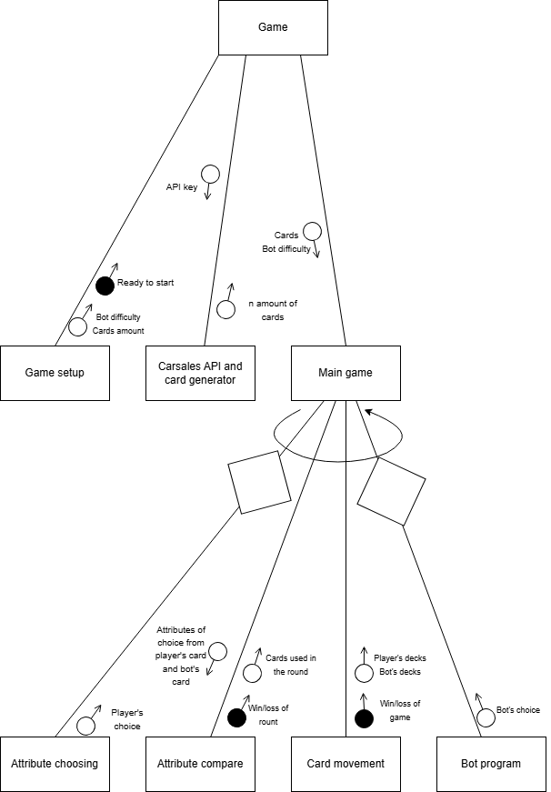
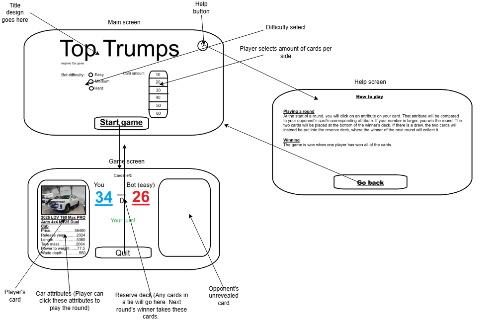

# 2026-Software-Engineering-Assessment-2

## Game mechanics design (Part A, D & E):
### Data selection and game attributes:
The game will use six attributes from cars in carsale, in the order of possibly most powerful to least powerful attribute:

- Price
    - This is an easy, familiar and highly obvious stat that people will instantly recognise. However, having higher prices usually correspond to having higher other attributes. 
- Release year
    - Newer cars 
- Tare mass
    - Cars are highly variable in terms of tare mass, and this. However, it is probably affected by price. 
- Power to weight
    - This is chosen instead of engine power to remove the heavy car advantage as they require more power to move at the same speed. Engine quality is sometimes measured in time to accelerate to 100 km/h, but I was unable to find it on carsales, and I don't want to explain to those who don't know cars that this stat is best when it is low, considering other stats are the higher the better. 
- Wade depth
    - This is for z
- Length
    - This is a 'wild card' stat, hopefully redeeming any 'bad' cars that appear, but otherwise probably has little influence on the game and was placed to create the sixth attribute. 

### Game procedure:

1. The player and opponent (a bot) will each be dealt a certain number of cards. The exact number is determined by the player, ranging from 10 to 60 per player. 
2. The player will be shown a card. They will be able to select one attribute to compare with the opponent's
3. The opponent's card then revealed, and the corresponding value compared. If the player's value is larger, the two cards will be placed at the bottom of the player's deck, and the player may choose the attribute in the next round, otherwise it will be put into the opponent's deck, and the opponent chooses the next attribute. 
4. Should a draw occur, the two cards will be placed in a 'reserve deck'. When the next round is played, cards in the reserve deck will be given to the winner. 
5. Game will continue until one side has all of the cards, that player declared the winner of the game. 

### User interface

1. The player will be greeted with a setup game menu. This will have bot difficulty, number of cards per side (10 - 60) and play button. 
2. After the game, the player will be asked if they want to play again. 

### Structure chart:

### UI Story boards:
