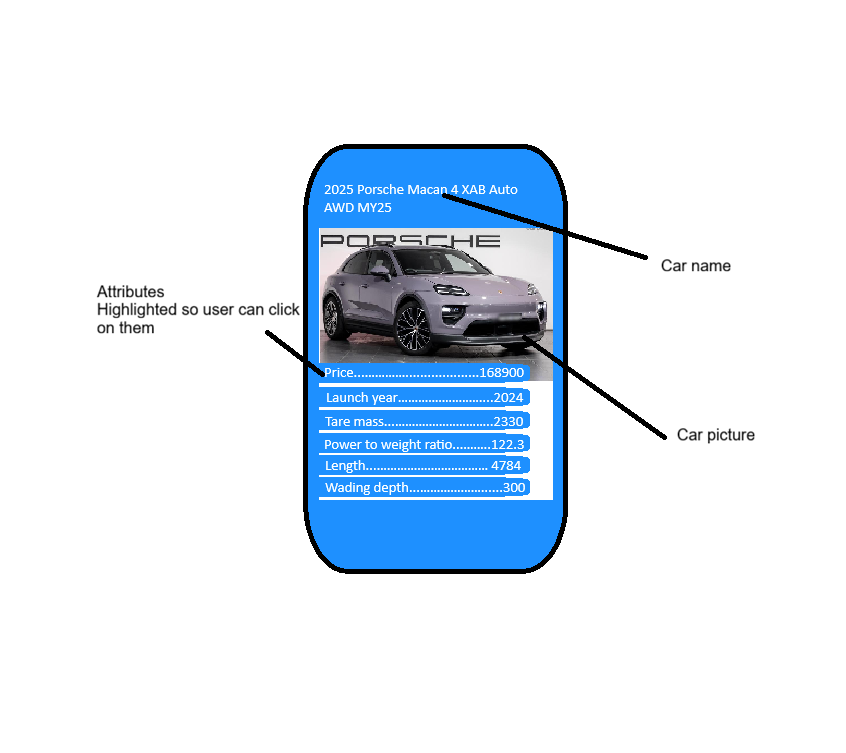
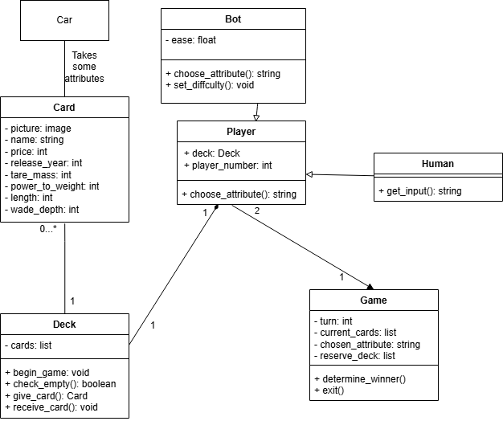

# 2026-Software-Engineering-Assessment-2

## Game mechanics design (Part A, D & E):
### Data selection and game attributes:
The game will use six attributes from cars in carsale, in the order of possibly most powerful to least powerful attribute:

- Price
    - This is an easy, familiar and highly obvious stat that people will instantly recognise. However, having higher prices usually correspond to having higher other attributes. 
- Release year
    - This is another obvious stat that people will also understand quickly. However, this alone can cause a 'crappy' car to beat an extremely good car just because it was slightly older, but usually this would cause a draw because there are only so many years a car can be made in that can be sold on carsales.com.au. 
- Tare mass
    - Cars are highly variable in terms of tare mass, and this. However, it is probably affected by price. 
- Power to weight
    - This is chosen instead of engine power to remove the heavy car advantage as they require more power to move at the same speed. Engine quality is sometimes measured in time to accelerate to 100 km/h, but I was unable to find it on carsales, and I don't want to explain to those who don't know cars that this stat is best when it is low, considering other stats are the higher the better. 
- Length
    - There needs to some information on the car's dimensions. Length is quite basic, but works. 
- Wade depth
    - This is a 'wild card' stat, hopefully redeeming any 'bad' cars that appear as this is not affected much by other stats, but otherwise probably has little influence on the game and was placed to create the sixth attribute.

Game balance:

An attribute would be considered unfair when such attribute correlates to other attributes becoming high. This makes some cars overpowered while others will have no chances. In order to make the game more fair, I have chosen attributes that are quite seperate from each other so there is more chance that cards are not totally overpowered and others completely useless. 

### Game procedure:

1. The player and opponent (a bot) will each be dealt a certain number of cards. The exact number is determined by the player, ranging from 10 to 60 per player. 
2. The player will be shown a card. They will be able to select one attribute to compare with the opponent's
3. The opponent's card then revealed, and the corresponding value compared. If the player's value is larger, the two cards will be placed at the bottom of the player's deck, and the player may choose the attribute in the next round, otherwise it will be put into the opponent's deck, and the opponent chooses the next attribute. 
4. Should a draw occur, the two cards will be placed in a 'reserve deck'. When the next round is played, cards in the reserve deck will be given to the winner. 
5. Game will continue until one side has all of the cards, that player declared the winner of the game. 

### User interface

1. The player will be greeted with a setup game menu. This will have bot difficulty, number of cards per side (10 - 60) and play button. 
2. After the game, the player will be asked if they want to play again. 

### Structure chart:

### UI Story boards:

### Card design (improved):

## Classes & diagram (Part B & C)
### Diagram

### Classes explanation:
#### Car:
> This refers to raw car data taken from carsales.com.au. 

Data:
- Too many to list (Whatever comes up in the features and specifications tab when you search a car in carsales.com.au)

Methods: 
- None

#### Card:
> This inherits the name, picture and six attributes from car class. 

Data:
- picture: image
- name: string
- price: int
- release_year: int
- tare_mass: int
- power_to_weight: int
- length: int
- wade_depth: int

Method:
- None

#### Deck
> This contains cards for the player and bot

Data:
- cards: list

Methods:
+ begin_game: void
+ check_empty(): boolean
+ give_card(): Card
+ receive_card(): void

#### Player
> This is the class that the user directly interacts with. Players choose the attribute they want to compare in the round. 

Data:
- deck: Deck

Methods:
- choose_attributes(): string

#### Bot
> This is a variant of player class that is computer controlled. Its difficulty is determined by the ease variable, which is the chance that the bot chooses a suboptimal attribute on the card. It determines the optimal attribute by taking the average of each attribute in its deck and comparing the percentage difference between each attribute on the card. 

Data:
- ease: float
- averages: list

Methods:
+ get_averages(): void
+ choose_attribute(): string (This overrides `player.choose_attribute()`)
+ set_diffculty(): void 

#### Game
> This is the main game system. This keeps track of whose turn it is to choose an attribute. It processes all of the cards played during the round and determines who wins the round, and in the event of a tie, keep the cards to give to next round's winner. 

Data:
- turn: int
- current_cards: list
- chosen_attribute: string
- reserve_deck: list

Methods:
+ determine_winner()
+ exit()

## Ethical, legal, envrionmental (Part F)
**Individual**

This game affects individuals by encouraging that large and expensive cars are better. This is because of the way the game prioritises cars of higher cost, newest year, and largest size, weight and height (in the form of wade height). This will cause people to value expensive cars. 

**Social**

This game affects society by making expensive and large cars appear like status symbols and exclude those who cannot buy them. The game favours new cars with larger sizes, prices and motor efficiency (seperate from engine sustainability), making users spend unecessarily on these factors, or making it seem like losing cars are all they can afford. This causes unecessary spending as well as access inequality depending on an individual's socio-economic status. 

**Environmental**

This game seems to support big cars. Large cars tend to use more fuel or electricity, causing more carbon emissions. This is because length and tare weight attributes correspond directly to size and wade height probably corrrelates with height. This makes players favour large cars more, and this game would cause more large cars to be purchased, using more fuel and resources. 

**Legal**

In terms of misleading users, carsales.com.au is the most trusted second hand car sales website and information pulled from it would be accurate up to the pricing, as it may not be fully representative of a car model's value. However, as the creator of the game, I am to clearly state that this game is for education/entertainment and not to be taken as financial advice. 